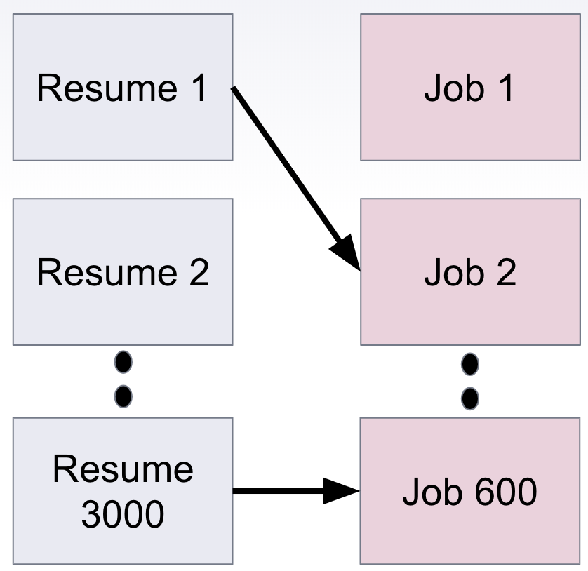

# Matching your Resume and Job Postings
## Background
This is a (NLP + supervised learning) project at Insight Data Science.
This is a consulted project with early-stage silicon valley company. **Therefore, all the data and most of the codes are confidential, which can't be public.** I do apologize for any unclear workflow. This repo will talk about the matching idea and only show the code for feature extraction by different embeddings.

## Motivation for this project:
There is a matching problem between your resume and multiple job postings.
<p float = 'left'>
 
</p>

The solution for this problem is to use NLP and supervised learning to predict whether the resume will match or not match the responding job postings.

### Conceptual Demo for the B2B Product
- **Input**: HR's job requirement and candidate's information
- **Output**: this product will surface the matched candidate

<p float = 'left'>
 
</p>

## File Descriptions
- **configs** : Enable modification of all preset variables within single directory (consisting of one or many config files for separate tasks)
- **data** \
|- output.txt  # The actual data is highly confidential. Therefore, this is a fake txt to conceptually show what it contains and also check whether the code work or not
- **images** : images include in the README
- **main_scripts** \
| - bert.py  # bert model\
| - word2vec300.py  # word2vec model \
| - tfidf.py  # term frequency  
- **README.md**

## Requisites

Here are all packages and software needed to build the environment

#### Dependencies

- [Streamlit](streamlit.io)
- pip=19.3.1
- python=3.7.3
- setuptools=44.0.0
- scikit-learn=0.21.2
- conda=4.8.2
- pip:
  - nltk==3.4.1
  - numpy==1.16.4
  - pandas==0.24.2
  - regex==2020.1.8
  - gensim==3.8.1

## Feature Extraction with Pre-trained Embedding Models
### TF-IDF
TF-IDF is short for term frequency–inverse document frequency, which is used to evaluate the importance of a term (feature) to each data point.

### Word2Vec
Word2vec is a word embedding model, which represents the word with vectors.
To run the word2vec300.py file, you have to download the embedded model first online. Here is the [link](https://wikipedia2vec.github.io/wikipedia2vec/pretrained/) for the model.
```
import gensim
model = gensim.models.KeyedVectors.load_word2vec_format('./enwiki_20180420_300d.txt',binary=False,limit=500000)
```

### Bert:SentenceTransformer
BERT is a state-of-the-art pre-trained model that can be used to derive sentence embeddings. Please follow this [link](https://github.com/UKPLab/sentence-transformers) to download these models first before running the bert.py.

Two models are used here.
-bert-base-nli-mean-tokens: BERT-base model with mean-tokens pooling.Trained on NLI data
-bert-base-nli-stsb-mean-tokens:Trained on STS data
You can use them in the following way:
```
model = SentenceTransformer('name_of_model')
for example: model = SentenceTransformer('bert-base-nli-mean-tokens')
```


## Configs
- The configuration file is written as environment.yml
