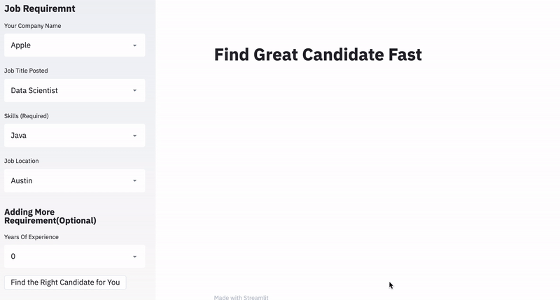

# Matching your Resume and Job Postings
This is a (NLP + supervised learning) project at Insight Data Science.

## Motivation for this project:
There is a matching problem between your resume and job postings.

The solution for this problem is to use NLP and supervised learning to predict whether the resume will match or not match the responding job postings.


<p float = 'left'>
 
</p>


- **main_scripts** : Put all source code for production within structured directory
- **tests** : Put all source code for testing in an easy to find location
- **configs** : Enable modification of all preset variables within single directory (consisting of one or many config files for separate tasks)
- **data** : Include example a small amount of data in the Github repository so tests can be run to validate installation
- **build** : Include scripts that automate building of a standalone environment
- **static** : Any images or content to include in the README or web framework if part of the pipeline


## Requisites

Here are all packages and software needed to build the environment

#### Dependencies

- [Streamlit](streamlit.io)
- pip=19.3.1
- python=3.7.3
- setuptools=44.0.0
- scikit-learn=0.21.2
- conda=4.8.2
- pip:
  - nltk==3.4.1
  - numpy==1.16.4
  - pandas==0.24.2
  - regex==2020.1.8
  - gensim==3.8.1

### Pre-trained embedding models
#### Word2Vec
word2vec is word embedding, which represents the word with vectors.
```
import gensim
model = gensim.models.KeyedVectors.load_word2vec_format('./enwiki_20180420_300d.txt',binary=False,limit=500000)
```

#### Bert:SentenceTransformer
BERT is a state-of-the-art pre-trained model that can be used to derive sentence embeddings. Please follow this [link](https://github.com/UKPLab/sentence-transformers) to download these models.

Two models are used here.
-bert-base-nli-mean-tokens: BERT-base model with mean-tokens pooling.Trained on NLI data
-bert-base-nli-stsb-mean-tokens:Trained on STS data
You can use them in the following way:
```
model = SentenceTransformer('name_of_model')
for example: model = SentenceTransformer('bert-base-nli-mean-tokens')
```


## Configs
- The configuration file is written as environment.yml
